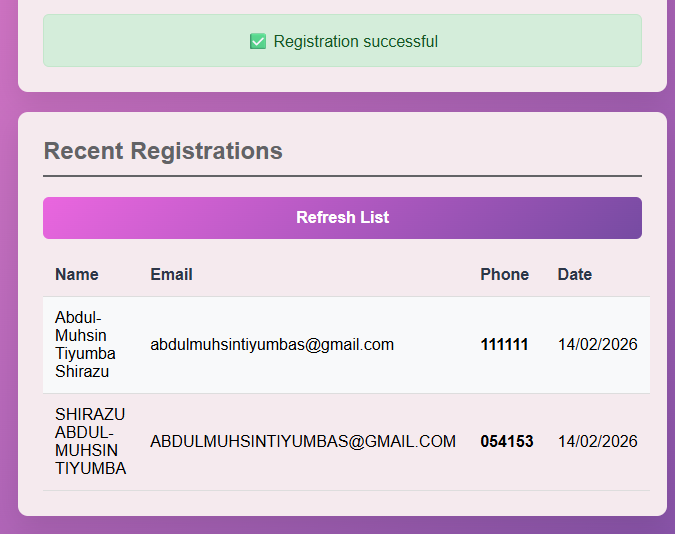
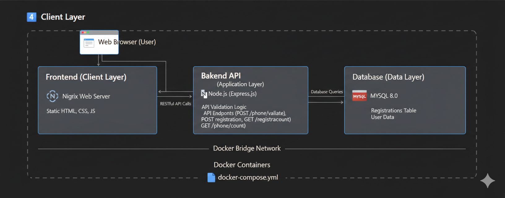
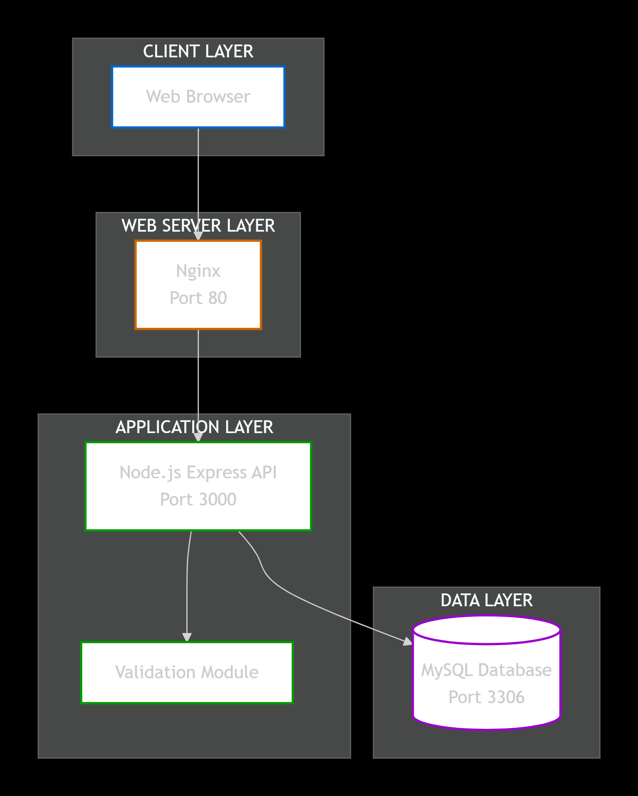

# Phone Validation Microservice Project

## 1. Project Overview

This project is a **Phone Number Validation and Registration System**. The system validates 6-digit phone numbers according to predefined mathematical rules, registers valid phone numbers into a database, and provides statistical information about valid and registered numbers.

<!-- Home Screens -->


## Phone Number Validation Rules

A phone number is considered **valid** if:

1. It is exactly **6 digits**.
2. It contains **at least one non-zero digit**.
3. The **sum of the first three digits** equals the **sum of the last three digits**.
4. The **sum of digits in odd positions** equals the **sum of digits in even positions**.

Validation logic is implemented in a dedicated module (`validation.js`) on the backend.

<!-- Registration Screens -->




This web-based application is designed using a **microservice-based architecture** and fully containerized using **Docker** and **Docker Compose**. It consists of three main components: a backend API, a MySQL database, and a frontend web interface.

---

## 2. System Architecture

The system follows a **three-tier architecture**:

1. **Frontend (Client Layer)**

   * Static web application (HTML, CSS, JavaScript)
   * Served using **Nginx**
   * Allows users to submit phone numbers and view results

2. **Backend API (Application Layer)**

   * Built with **Node.js (Express.js)**
   * Validates phone numbers
   * Handles database operations
   * Exposes RESTful API endpoints

3. **Database (Data Layer)**

   * **MySQL 8.0**
   * Stores registered users and phone numbers

All components communicate over a Docker bridge network.

<!-- System Architecture Screens -->



---

## 3. Technologies Used

* **Frontend:** HTML5, CSS3, JavaScript
* **Backend:** Node.js, Express.js
* **Database:** MySQL 8.0
* **Web Server:** Nginx
* **Containerization:** Docker, Docker Compose

---

## 4. API Endpoints

Base URL:

```
http://localhost:3000/api
```

### 4.1 Validate Phone Number

**POST** `/phone/validate`

**Request Body:**

```json
{
  "number": "054153"
}
```

**Response:**

```json
{
  "number": "054153",
  "rules": {
    "hasNonZeroDigit": true,
    "sumFirstEqualsLast": true,
    "sumOddEqualsEven": true
  },
  "isValid": true
}
```

---

### 4.2 Register Phone Number

**POST** `/registration`

**Request Body:**

```json
{
  "name": "John Doe",
  "email": "john@example.com",
  "phone": "054153"
}
```

**Success Response:**

```json
{
  "status": "accepted",
  "message": "Registration successful"
}
```

---

### 4.3 Get Registered Phone Numbers

**GET** `/registrations`

**Response:**

```json
[
  {
    "name": "John Doe",
    "email": "john@example.com",
    "phone": "054153",
    "created_at": "2025-12-13"
  }
]
```

---

### 4.4 Get System Statistics

**GET** `/phone/count`

**Response:**

```json
{
  "totalPossibleValidNumbers": 55252,
  "registeredValidNumbers": 1
}
```

---

## 5. Database Structure

The database schema is initialized automatically when the MySQL container starts.

```sql
CREATE TABLE registrations (
    id INT AUTO_INCREMENT PRIMARY KEY,
    name VARCHAR(100) NOT NULL,
    email VARCHAR(150) NOT NULL,
    phone CHAR(6) UNIQUE NOT NULL,
    created_at TIMESTAMP DEFAULT CURRENT_TIMESTAMP
);
```

---

## 6. Running the Project (Docker)

### 6.1 Prerequisites

* Docker Desktop installed
* Docker Compose enabled

### 6.2 Start the Application

From the project root directory:

```bash
docker-compose up --build
```

### 6.3 Access the Application

* **Frontend:** [http://localhost](http://localhost)
* **Backend API:** [http://localhost:3000/api](http://localhost:3000/api)

---

## 7. Project Folder Structure

```
phone-validation/
│
├── docker-compose.yml
│
├── backend-api/
│   ├── Dockerfile
│   ├── package.json
│   ├── server.js
│   └── validation.js
│
├── db/
│   └── init.sql
│
└── frontend/
    ├── Dockerfile
    ├── index.html
    ├── css/
    │   └── styles.css
    └── js/
        └── client.js
```

---

## 8. Conclusion

This project demonstrates the practical application of web technologies using a microservice architecture. It integrates frontend development, backend API design, database management, and containerization using Docker.

---

## 9. Author

**Course:** Web Technologies
**Project:** Phone Validation Microservice
**Student:** ABDULMUHSIN TIYUMBA SHIRAZU
